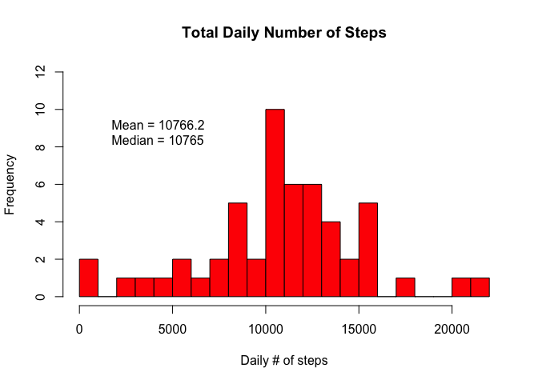
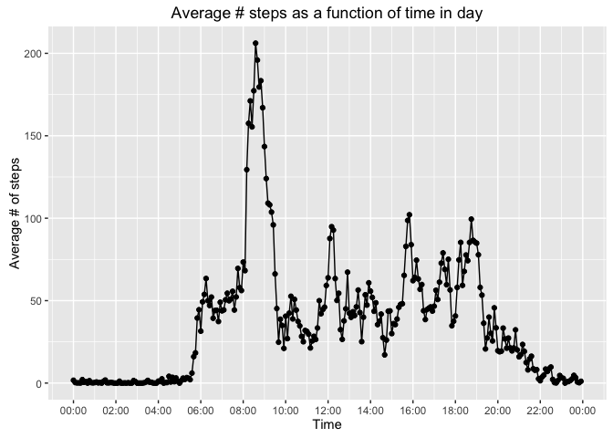
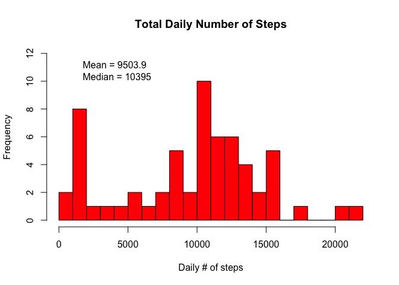
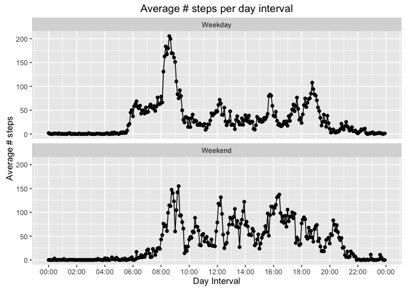

# Reproducible Research: Course Project 1

Project by Charles-Philippe Lajoie, as part of the Coursera Data Scientist Reproducible Research course.

The project looks at a CSV file containing the number of steps taken by a person (monitored with some personal device) as a function of time (daily 5-minute intervals) for two months. 

## Loading & preprocessing the data
The data contains 3 colums: steps, date, and interval. The CSV file is read in R and any rows with NA are, for the moment, discarded. Strings representing dates are also converted to R dates variables.

```r
library(dplyr)
library(ggplot2)
library(chron)

rawtable=read.csv("activity.csv")

mytable <- filter(rawtable, is.na(steps)==FALSE)
mytable$date <- as.Date(mytable$date, format="%Y-%m-%d" )
```
 
## What is mean total number of steps taken per day?

```r
#GROUP DATA BY DATE:
daily <- group_by(mytable, date)
totalSteps <- summarise(daily, sumSteps=sum(steps))

meanSteps=mean(  totalSteps$sumSteps)
mediSteps=median(totalSteps$sumSteps)
print(meanSteps)
```

```
## [1] 10766.19
```



## What is the average daily activity pattern?


```r
mytable$interval <- strptime(sprintf("%04d", as.numeric(mytable$interval)), format="%H%M")
mytable$interval <- as.POSIXct(mytable$interval, format="%H:%M:%S")

inter <- group_by(mytable, interval)
meanSteps <- summarise(inter, meanSteps=mean(steps))

timemax <- meanSteps$interval[which.max(meanSteps$meanSteps)]

g <- ggplot(meanSteps, aes(interval, meanSteps)) + geom_point() + geom_line()
g <- g + labs(title = "Average # steps as a function of time in day") 
g <- g + labs(x = "Time", y = "Average # of steps")
g <- g + scale_x_datetime(date_breaks="2 hour", labels=date_format_tz("%H:%M", tz="EST"))
print(g)
```



The time at which the maximum average number of steps occured on 2016-02-15 08:35:00.


## Imputing missing values

```r
missing <- filter(rawtable, is.na(steps)==TRUE)
nrow_missing <- (nrow(missing))
```
There are 2304 rows with values NA in the original dataset.

Here, we are filling the NA values for a given day interval with the median of that interval for all 60 days (or so).


```r
for(i in 1:nrow(missing)){
  int <- missing$interval[i]
  missing$steps[i] <- meanSteps$meanSteps[meanSteps$interval==int]
}

allvalues <- rbind(cleantable, missing)
allvalues$date <- as.Date(allvalues$date, format="%Y-%m-%d" )

# GROUP BY DATE & CALCULATE DAILY AVERAGE:
date_groups <- group_by(allvalues, date)
all <- summarise(date_groups, sumSteps=sum(steps))

meanSteps=mean(  all$sumSteps)
mediSteps=median(all$sumSteps)

print(meanSteps)
```

```
## [1] 9503.869
```



Our results show that by filling the NA with the median of the day interval changes the average slightly but does not affect the median significantly.

## Are there differences in activity patterns between weekdays and weekends?

```r
# CREATE FACTOR COLUMN FOR WEEKDAYS & WEEKENDS:
dayofweek   <- is.weekend(allvalues$date) 
dayofweek.f <- factor(dayofweek, labels=c("Weekday","Weekend"))
finaltable <- cbind(allvalues, dayofweek.f)

finaltable$interval <- strptime(sprintf("%04d", as.numeric(finaltable$interval)), format="%H%M")
finaltable$interval <- as.POSIXct(finaltable$interval, format="%H:%M:%S")

## GROUP BY INTERVALS & WEEKDAY/WEEKEND:
inter <- group_by(finaltable, interval, dayofweek.f)
aveSteps <- summarise(inter, meanSteps=mean(steps))

# PLOT RESULTS:
g <- ggplot(aveSteps, aes(interval, meanSteps)) + geom_point() + geom_line()
g <- g + labs(title = "Average # steps per day interval") 
g <- g + labs(x = "Day Interval", y = "Average # steps")
g <- g + facet_wrap(~dayofweek.f, ncol=1)#facet_grid(dayofweek.f ~ .) # + ylim(0,120)
g <- g + scale_x_datetime(date_breaks="2 hour", labels=date_format_tz("%H:%M", tz="EST"))

print(g)
```



Breaking the data down into week days and weekends show little difference other than the fact that the number of steps early in the morning (06:00am to 08:00am) is much lower during the weekends than on week days. This suggests that the person that wore the step counting device likes to sleep in on the weekends.


