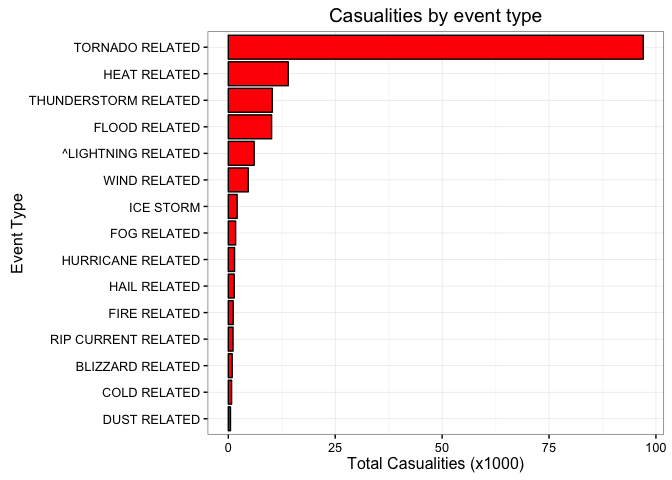
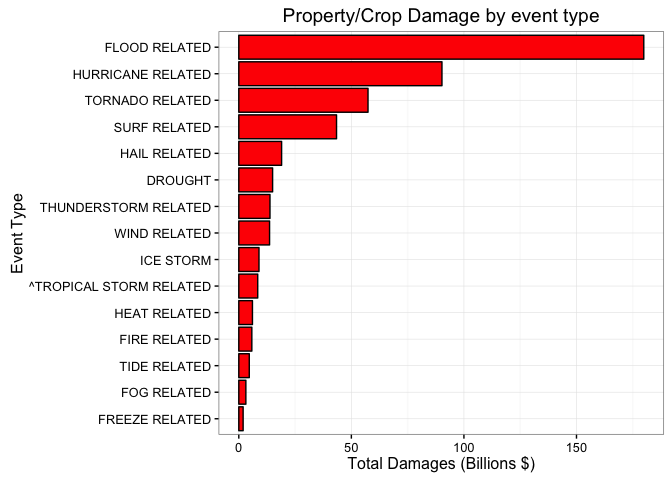

# Exploring the National Weather Service Storm Dataset

Project by Charles-Philippe Lajoie, as part of the Coursera Data Scientist Reproducible Research course.

# Synopsis

This project is aimed at exploring the National Weather Service Storm dataset, which tracks storms and significant weather events from 1950 to 2011 that were of sufficient intensity to cause personal and/or property damages. The dataset analysis is kept simple for the exploratory purposes and consists of (1) cleaning up the data, in particular the event type names, (2) summing up the number of casualties (fatalities+injuries) for each event type, and (3) summing up the total property/crop damages for each event type.


# Data Processing

### Downloading the Dataset

The data can be downloaded directly from the Coursera Reproducible Research website at the following link: https://d396qusza40orc.cloudfront.net/repdata%2Fdata%2FStormData.csv.bz2


```r
library(dplyr)
library(ggplot2)
```


```r
downloaded_csv <-"repdata-data-StormData.csv"
if (!file.exists(downloaded_csv)) {
  download.file("https://d396qusza40orc.cloudfront.net/repdata%2Fdata%2FStormData.csv.bz2", destfile=downloaded_csv, method="curl")
  originaldata <- read.csv(bzfile(downloaded_csv))
}
```


### Cleaning up the Storm Dataset

A bit of exploration shows that the event type (column EVTYPE) does not have a standard format, and that in many instances the same event, such as thunderstorm, can be written differently (e.g. TSTM, tstm, Thunderstorm, etc). Moreover, some event type are more descriptive than others, so we decided to regroup the events into more general categories, such as Thunderstorm related, Hail related, and so on. We believe that such a grouping does simplify the analysis without sacrificing the end results. 

For the reason described just above, we add a column to our storm dataset: GEN_EVTYPE. Moreover, we define casualties as the sum of fatalities and injuries. Similarly for total damages, which we define as the total of property and crop damages:

```r
stormdata <- mutate(stormdata, GEN_EVTYPE=EVTYPE)
stormdata$GEN_EVTYPE <- as.character(stormdata$GEN_EVTYPE)

stormdata <- mutate(stormdata, CASUALTIES=FATALITIES+INJURIES)

# USE EXPONENT TO DETERMINE SCALE FACTOR FOR DAMAGES:
stormdata <- mutate(stormdata, PROPDMGEXP_INT = ifelse(PROPDMGEXP == "B", 1000000000.,
                                     ifelse(PROPDMGEXP == "M", 1000000.,
                                     ifelse(PROPDMGEXP == "K", 1000.,
                                     ifelse(PROPDMGEXP == "H", 100., 0.)))) )

stormdata <- mutate(stormdata, CROPDMGEXP_INT = ifelse(CROPDMGEXP == "B", 1000000000.,
                                     ifelse(CROPDMGEXP == "M", 1000000.,
                                     ifelse(CROPDMGEXP == "K", 1000.,
                                     ifelse(CROPDMGEXP == "H", 100., 0.)))) )

stormdata <- mutate(stormdata, TOTALLOSS = PROPDMG*PROPDMGEXP_INT + CROPDMG*CROPDMGEXP_INT)
```

For sake of clarity, we also select only relevant columns for our simple analysis. 

```r
stormdata <- select(stormdata, STATE, EVTYPE, GEN_EVTYPE, CASUALTIES, TOTALLOSS)
```

The code chunk below is the actual cleaning of the EVTYPE column into the new GEN_EVTYPE column, where we have defined the most prevalent event types. The code loops through all these keywords and assigns the GEN_EVTYPE variable to each row accordingly:

```r
stormdata$EVTYPE <- toupper(stormdata$EVTYPE)
keys=c("SNOW", "RAIN", "HAIL", "WIND", "TORNADO", "^LIGHTNING", "FLOOD", "HURRICANE", "AVAL", 
       "FREEZE", "BURST", "DUST", "SURF", "TIDE", "COLD", "HEAT", "FIRE", "^TROPICAL STORM", 
       "BLIZZARD", "FOG", "RIP CURRENT", "SUMMARY")

for(ievent in keys){
  idx  <- grep(paste("*",ievent,"*",sep=""), stormdata$EVTYPE)
  stormdata$GEN_EVTYPE[idx] = paste(ievent,"RELATED")
}

# SPECIAL CASE: THUNDERSTORM WINDS:
idx  <- grep("*TSTM*", stormdata$EVTYPE)
idx  <- c(idx, grep("*THUNDERSTORM*", stormdata$EVTYPE))
stormdata$GEN_EVTYPE[idx] = "THUNDERSTORM RELATED"
```


# Results

We explored the storm dataset with two starting ideas: which events caused (1) the most casualties and (2) the most damages.

### Total Casualties
We have defined casualties as the sum of all fatalities and injuries (columns FATALITIES and INJURIES), and the code chunk below performs this summation for each general event type:

```r
casualties <- group_by( filter(stormdata, CASUALTIES>0), GEN_EVTYPE)
sum_casualties <- summarise(casualties, sum=sum(CASUALTIES))
sum_casualties <- arrange(sum_casualties, desc(sum))
sum_casualties <- sum_casualties[1:15,]
sum_casualties$sum <- sum_casualties$sum / 1e3

g <- ggplot(sum_casualties, aes(reorder(GEN_EVTYPE,sum), sum)) 
g <- g + geom_bar(fill="red", col="black", stat="identity") # stat="identity" b/c plotting the column value.
g <- g + xlab("Event Type") + ylab("Total Casualities (x1000)") 
g <- g + coord_flip()  # Showing the events name on the Y axis since it's easier to read.
g <- g + labs(title="Casualities by event type") + theme_bw()
print(g)
```



### Total Damages
We have defined total damages as the sum of all property and crop losses (columns PROPDMG and CROPDMG), and the code chunk below performs this summation for each general event type:

```r
damages <- group_by( filter(stormdata, TOTALLOSS>0), GEN_EVTYPE)
sum_damages <- summarise(damages, sum=sum(TOTALLOSS))
sum_damages <- arrange(sum_damages, desc(sum))
sum_damages <- sum_damages[1:15,] 
sum_damages$sum <- sum_damages$sum / 1e9

# PLOT RESULTS:
g <- ggplot(sum_damages, aes(reorder(GEN_EVTYPE,sum), sum)) 
g <- g + geom_bar(fill="red", col="black", stat="identity") # stat="identity" b/c plotting the column value.
g <- g + xlab("Event Type") + ylab("Total Damages (Billions $)") 
g <- g + coord_flip()  # Showing the events name on the Y axis since it's easier to read.
g <- g + labs(title="Property/Crop Damage by event type") + theme_bw()
print(g)
```




# Conclusion

Our initial results are quite revealing: 
* tornadoes have been responsible for most of the reported casualties; 
* floods have caused the most financial damages.  

Interestingly, heat-related casualties rank second for casualties but, not suprisingly, have not caused any significant property or crop damages. However, one could argue that drought are related to heat and if one were to combine these two events, the total damages would rank higher.

The subjectivity in the grouping and naming of the significant weather events is apparent is such an exploratory analysis and only highlights the need for a stricter naming convention for such events. 
